# `pipeline_test.py` Full Pipeline Visual

This document is a visual map of the full execution flow in `scripts/pipeline_test.py`, including optional skip branches and final outputs.

## High-Level Flow

```mermaid
flowchart TD
    A[Start: parse CLI args] --> B[Resolve paths and defaults]
    B --> C[Dependency preflight checks]
    C --> D{Preflight failures?}
    D -->|Yes + strict deps| E[[Fail fast]]
    D -->|No or non-strict| F[Optional cleanup of existing data dir]

    F --> G{--skip-configure?}
    G -->|No| H[Configure CMake]
    G -->|Yes| I[Skip configure]
    H --> J{--skip-build?}
    I --> J

    J -->|No| K[Build vector_db]
    J -->|Yes| L[Skip build]
    K --> M[Verify vectordb_cli exists]
    L --> M

    M --> N{--skip-ctest?}
    N -->|No| O[Run CTest]
    N -->|Yes| P[Skip tests]
    O --> Q{--skip-generate?}
    P --> Q

    Q -->|No| R[Generate synthetic dataset]
    Q -->|Yes| S[Use existing payloads]
    R --> T[Validate payload file and row count]
    S --> T

    T --> U[CLI init store]
    U --> V[CLI bulk-insert payloads]
    V --> W[CLI checkpoint]
    W --> X[CLI build initial clusters]
    X --> Y[CLI read cluster stats JSON]
    Y --> Z[Pick source_version]
    Z --> AA[CLI build second-level clusters]
    AA --> AB[Load SECOND_LEVEL_CLUSTERING.json]
    AB --> AC[Print final first-layer and second-layer summaries]
    AC --> AD[Write pipeline_test_report.json]
    AD --> AE[Print timing accuracy report and save rolling timings]
    AE --> AF{--keep-data?}
    AF -->|No| AG[Delete data dir]
    AF -->|Yes| AH[Preserve data dir]
    AG --> AI[[PASS]]
    AH --> AI
```

## Step-by-Step Stage View

```mermaid
flowchart LR
    subgraph Preflight
      P1[Check Python]
      P2[Check CMake if needed]
      P3[Check CTest if needed]
      P4[Check vector_db folder]
      P5[Check generator script exists]
      P6[Check binary if skip-build]
      P7[Check payloads if skip-generate]
    end

    subgraph Build_and_Test
      B1[Configure CMake]
      B2[Build Release]
      B3[CTest]
    end

    subgraph Data_Prep
      D1[Run generate_synthetic_embeddings.py]
      D2[Validate payload path]
      D3[Count payload rows >= 12]
    end

    subgraph Pipeline_CLI_Flow
      C1[vectordb_cli init]
      C2[vectordb_cli bulk-insert]
      C3[vectordb_cli checkpoint]
      C4[vectordb_cli build-initial-clusters]
      C5[vectordb_cli cluster-stats]
      C6[vectordb_cli build-second-level-clusters]
    end

    subgraph Finalization
      F1[Read SECOND_LEVEL_CLUSTERING.json]
      F2[Print final cluster summary]
      F3[Write pipeline_test_report.json]
      F4[Timing report + save timing history]
      F5[Optional data dir cleanup]
    end

    Preflight --> Build_and_Test --> Data_Prep --> Pipeline_CLI_Flow --> Finalization
```

## What Each Main Step Produces

1. **Preflight**
   - Validates toolchain/runtime assumptions before expensive work.
   - Can fail-fast when `--strict-deps` is enabled.

2. **Configure / Build / CTest**
   - Produces `vectordb_cli` in `vector_db/build`.
   - Runs `vectordb_tests` via `ctest` unless skipped.

3. **Dataset Generation**
   - Creates synthetic vectors + payload files (unless skipped).
   - Ensures payloads are present and non-trivial for insertion.

4. **Pipeline CLI Flow**
   - Builds store state and first-level clustering artifacts.
   - Reads first-layer `cluster-stats`, then runs second-level clustering.

5. **Final Output**
   - Reads `SECOND_LEVEL_CLUSTERING.json`.
   - Prints concise terminal summary for both layers.
   - Writes `vector_db/pipeline_test_report.json`.
   - Writes/updates timing history in `.vector_db_pipeline_test_timings.json`.

## Primary Control Flags (Branch Points)

- `--skip-configure` / `--skip-build` / `--skip-ctest` / `--skip-generate`
- `--strict-deps` / `--no-strict-deps`
- `--keep-data`
- `--source-version` (override instead of using first-layer stats version)

