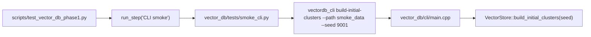
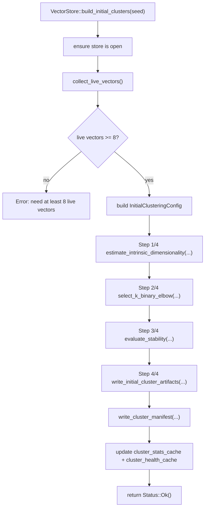

# Initial + Second-Level Clustering Walkthrough

This document explains the exact execution flow of the **initial clustering** and **second-level clustering** portions of the Vector DB phase test.

## Entry Point Chain



## Test-Side Trigger (What Runs)

1. `scripts/test_vector_db_phase1.py` runs `CLI smoke` by invoking:
   - `python tests/smoke_cli.py` (cwd: `vector_db`).
2. `vector_db/tests/smoke_cli.py` executes:
   - `vectordb_cli build-initial-clusters --path smoke_data --seed 9001`
3. After build, smoke checks:
   - `cluster-stats` and `cluster-health` commands
   - existence of `smoke_data/clusters/initial/cluster_manifest.json`

## CLI Dispatch Layer

In `vector_db/cli/main.cpp`:

- `build-initial-clusters` command:
  - calls `open_or_fail()` (which ensures store is initialized/opened/replayed),
  - parses `--seed`,
  - calls `store.build_initial_clusters(seed)`,
  - prints `ok: initial clusters built` on success.

## Internal Build Pipeline

The core implementation is in `vector_db/src/vector_store.cpp` (`VectorStore::build_initial_clusters`).



## What Each Step Does

### Step 1/4: Intrinsic Dimensionality Estimation

Function: `estimate_intrinsic_dimensionality(...)` in `vector_db/src/clustering/id_estimator.cpp`

- Samples vectors (bounded by config min/max sample).
- Computes nearest and second-nearest neighbor distances.
- Estimates local intrinsic dimensions (`m` values).
- Produces:
  - `m_low`, `m_high`,
  - derived `k_min`, `k_max` search bounds for clustering.

### Step 2/4: Binary Elbow K Selection

Function: `select_k_binary_elbow(...)` in `vector_db/src/clustering/elbow_search.cpp`

- Builds an integer `k` grid between `k_min` and `k_max`.
- Fits spherical k-means models for candidate `k` values.
- Uses objective gain to decide elbow point (`chosen_k`), with flatness fallback rule.
- Returns:
  - best `KMeansModel`,
  - `ElbowSelection` trace (`k`, objective, gain).

### Step 3/4: Stability Evaluation

Function: `evaluate_stability(...)` in `vector_db/src/clustering/stability.cpp`

- Runs clustering multiple times with different seeds (`stability_runs`).
- Computes pairwise consistency metrics:
  - NMI,
  - Jaccard (top-m assignment overlap),
  - centroid drift.
- Produces `StabilityMetrics` and pass/fail decision.

### Step 4/4: Artifact + Manifest Writes

Functions in `vector_db/src/vector_store.cpp`:

- `write_initial_cluster_artifacts(...)` writes versioned artifacts.
- `write_cluster_manifest(...)` writes summary manifest consumed by CLI stats/health.

## GPU/Tensor-Core Execution Model

Current clustering path is GPU-only for scoring/assignment/reduction in `vector_db/src/clustering/elbow_search.cpp`:

- Requires CUDA scoring + assignment kernels (`cuda_dot_products_available` and `cuda_assignment_kernels_available`).
- Uses CUDA iteration path:
  - `cuda_kmeans_iteration_top1(...)`
  - `cuda_topm_from_centroids(...)`
- No CPU fallback in clustering path; failures return explicit errors.
- Backend and tensor-core usage are recorded in `KMeansModel` and persisted to cluster manifest.

## Files Produced by Initial Clustering

Under data path (`--path`, e.g. `smoke_data`):

```text
smoke_data/
  clusters/
    initial/
      cluster_manifest.json
      v<version>/
        id_estimate.json
        elbow_trace.json
        stability_report.json
        centroids.bin
        assignments.json
```

## How Smoke Test Verifies This Stage

In `vector_db/tests/smoke_cli.py`, after running `build-initial-clusters`:

- Calls `cluster-stats` and asserts:
  - `available == true`,
  - `chosen_k` within `[k_min, k_max]`,
  - presence of `gpu_backend`, `tensor_core_enabled`, `scoring_ms_total`, `scoring_calls`.
- Calls `cluster-health` and asserts `available == true`.
- Confirms `clusters/initial/cluster_manifest.json` exists.
- Re-opens in a fresh process and verifies `cluster-stats.version` is stable.

## Second-Level Clustering (All Parent Centroids)

Second-level clustering is triggered from the CLI with:

- `vectordb_cli build-second-level-clusters --path <data_dir> [--seed <u32>] [--source-version <u64>]`

Execution in `VectorStore::build_second_level_clusters(...)`:

1. Loads first-layer assignments from:
   - `clusters/initial/v<source_version>/assignments.json`
2. Groups vectors by parent centroid `top[0]`.
3. Processes centroid groups in descending size order (throughput-oriented).
4. For each centroid with enough vectors:
   - loads subset vectors
   - runs the same GPU-first pipeline used by initial clustering:
     - ID estimate
     - INT8 elbow search
     - FP16 refit for chosen `k`
     - stability evaluation
5. Writes per-centroid artifacts and per-centroid manifest.
6. Writes aggregate second-level summary document.

Second-level output layout:

```text
<data_dir>/
  clusters/
    initial/
      v<source_version>/
        second_level_clustering/
          SECOND_LEVEL_CLUSTERING.json
          centroid_<id>/
            id_estimate.json
            elbow_trace.json
            stability_report.json
            centroids.bin
            assignments.json
            manifest.json
```

The aggregate document includes per-centroid CUDA/tensor-core telemetry and total throughput (`vectors_per_second`).

