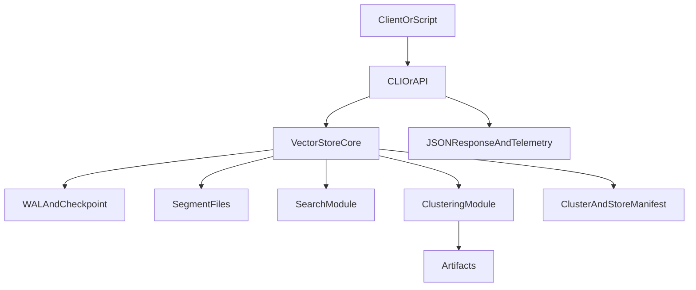

# 02 System Architecture

## Purpose

Describe the v2 component boundaries and end-to-end request/data flow for storage, search, and clustering.

## Inputs/Dependencies

- [01 Product and Requirements](./01_PRODUCT_AND_REQUIREMENTS.md)
- [03 Storage and Durability](./03_STORAGE_AND_DURABILITY.md)
- [04 Indexing and Search](./04_INDEXING_AND_SEARCH.md)
- [05 Clustering Pipeline](./05_CLUSTERING_PIPELINE.md)

## Component Model

- **API/CLI Surface**
  - Accepts user operations and emits stable JSON contracts.
- **Core Store Engine**
  - Owns record lifecycle, manifests, WAL, checkpoint, and in-memory caches.
- **Search Layer**
  - Executes exact vector-similarity scoring and ranking in M1.
- **Clustering Layer**
  - Runs Top/Mid/Lower/Final clustering stages with outputs.
- **Artifact/Manifest Writer**
  - Persists parseable outputs for diagnostics and reproducibility as one active clustering state in M1.

## Runtime Boundaries

- API/CLI does parsing and validation only.
- Store engine owns data correctness and persistence semantics.
- Search/clustering modules own numerical algorithms and telemetry, and execute performance-critical paths in C++/CUDA.
- No cross-module hidden state mutation; all state transitions are explicit through store methods.
- M1 numeric boundary is explicit: FP32 input embeddings -> INT8 k-selection (optimal cluster-count estimation) -> FP16 final clustering and assignment.
- Runtime design requirement: minimize host-device transfers and keep eligible compute/data residency on GPU across stage boundaries where practical.
- Hardware compliance requirement: performance-critical path execution must target Ampere-class CUDA runtime and Tensor Core-capable kernels where eligible.
- Observability requirement: each pipeline stage emits terminal-visible machine-parseable lifecycle events for start, end/fail, stage elapsed time, and cumulative pipeline elapsed time.

## High-Level Flow

## Key Execution Paths

- **Write path:** validate -> append WAL -> apply state -> periodic checkpoint.
- **Read path:** validate query vector -> score live embeddings exactly -> rank top-k by vector similarity -> return IDs/scores.
- **Top layer path:** load live vectors -> estimate k-range -> elbow select -> realize selected `k` via Lloyd k-means with k-means++ init -> deterministic empty-cluster repair if needed -> evaluate/validate -> write top-layer artifacts.
- **Mid layer path:** start only after Top layer succeeds -> assign each embedding to top-1 Top-layer centroid -> build one child dataset per centroid -> run per-parent local k-selection + Lloyd k-means (k-means++ init) with no-empty guarantee -> write Mid-layer artifacts.
- **Lower layer path:** start only after Mid outputs exist -> run per-centroid continued-processing split gate using outlier subgroup evidence + local sibling baseline -> if gate passes, re-split full parent centroid dataset -> process each eligible child dataset with per-parent local k-selection + Lloyd k-means (k-means++ init, no-empty guarantee, no cross-centroid mixing) -> write per-centroid Lower-layer artifacts + aggregate summary + per-centroid timing events.
- **Final layer path:** start only after all required Lower-layer gate evaluations and eligible jobs complete -> consume eligible gate-fail leaf centroid datasets (`05` canonical eligibility rule) -> run passthrough per-leaf finalization (no cross-centroid mixing) using C++/CUDA implementation target for performance-critical execution -> write per-cluster Final-layer artifacts + aggregate Final-layer summary.

## Decisions and Rationale

- **Decision D-ARCH-001:** Keep a single `VectorStore` orchestration boundary for v2 M1.
  - Why: minimizes boundary churn while rewriting internals.
  - Rejected alternative: split into many services immediately. Rejected due to orchestration complexity before correctness baseline is stable.

## Open Questions

## Exit Criteria

- Every path above is mapped to at least one test category in [07 Testing and Validation](./07_TESTING_AND_VALIDATION.md).
- Boundaries are specific enough to assign implementation ownership per module.
